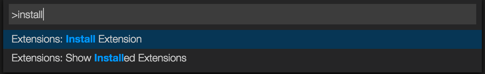

# vscode-linter-xo

[](https://travis-ci.org/spence-s/vscode-linter-xo)

> Linter for [XO](https://github.com/sindresorhus/xo)

## Usage

This extensions requires that [XO](https://github.com/sindresorhus/xo) is installed locally in your workspace folder. It will not load a globally installed XO version.

```shell
$ npm install --save-dev xo
```

or

```shell
$ yarn add -D xo
```

## Notes

- XO v0.40.0 and above were released as [pure ESM](https://gist.github.com/sindresorhus/a39789f98801d908bbc7ff3ecc99d99c). Therefore, it is required that Node.js versions 12+ be used to use this extension. If you are using an older version of Node.js please install an earlier version of XO.

In Visual Studio Code, press <kbd>F1</kbd> and narrow down the list of commands by typing `extension`. Pick `Extensions: Install Extension`.



Simply search for the `linter-xo` extension from the list and install it.

## Fix issues

Press `F1` and choose `XO: Fix all auto-fixable problems`


> Tip: Bind a keyboard shortcut to `xo.fix`

## Settings

Enable the linter in the VS Code Settings.

```json
{
	"xo.enable": true
}
```

You can also pass in extra options via the settings file.

```json
{
	"xo.enable": true,
	"xo.options": {
		"semicolon": false
	}
}
```

Or via the `package.json` file.

```json
{
	"name": "my-pkg",
	"xo": {
		"semicolon": false
	}
}
```

You can enable the formatter integration to use `xo --fix` as formatter. Requires `xo.enable` to be true. It is disabled by default.

```json
{
	"xo.enable": true,
	"xo.format.enable": true
}
```

## License

MIT © [Sam Verschueren](http://github.com/SamVerschueren)
