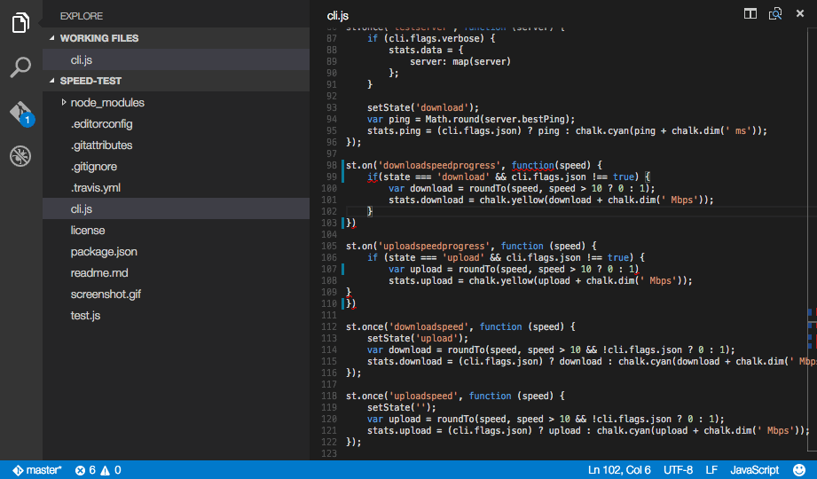

# vscode-linter-xo


> Linter for [XO](https://github.com/sindresorhus/xo)

## Usage

Just set up [XO](https://github.com/sindresorhus/xo) like you normally would in your project. This extensions requires that [XO](https://github.com/sindresorhus/xo) is installed locally in your workspace folder. It will not load a globally installed XO version. The extension will pickup the configuration in your workspace just like running [XO](https://github.com/sindresorhus/xo) in your terminal would. You will be able to see your linter work as you type and easily format your code if you want it to!

```shell
$ npm install --save-dev xo
```

or

```shell
$ yarn add -D xo
```

## Auto Format JS/TS Files XO

You can enable XO as a formatter for TypeScript and JavaScript. We recommend setting it up as follows:

In either your workspace or user settings add the following. It's generally best to make xo the default formatter for JavaScript and TypeScript files specifically as it will not be able to format other document types.

```js
{
	// optionally turn on format on save
	"editor.formatOnSave": true,
	"xo.enable": true,
	"xo.format.enable": true,
	"[javascript]": {
		"editor.defaultFormatter": "samverschueren.linter-xo"
	},
	"[typescript]": {
		"editor.defaultFormatter": "samverschueren.linter-xo"
	}
}
```

The XO extension also ships with a fix command that is accessible from the command pallete. This command will apply xo fixes to your JS or TS file regardless of any configuration.

To use: pull up the command pallete (usually `F1` or `Ctrl + Shift + P`) and choose `XO: Fix all auto-fixable problems`.



## Settings

Enable the linter in the VS Code Settings, this is on by default.

```json
{
	"xo.enable": true
}
```

You can also pass in extra options via vscode's settings. Note that these settings will override any configurations that xo finds in your local workspace.

```json
{
	"xo.options": {
		"rules": {
			"semicolon": false
		}
	}
}
```

You can enable the formatter integration to use `xo --fix` as formatter. Requires `xo.enable` to be true.

```json
{
	"xo.format.enable": true
}
```

You can override the severity of found issues, e.g. to make them stand out less than TypeScript errors.

```json
{
	"xo.overrideSeverity": "info"
}
```

You can adjust and tune a debounce that batches linting and helps optimize performance. The default is 150ms. This is a good number for most uses and we don't reccomending adjusting. Reducing for small files with simple configuration (200 or less LOC) may slightly improve performance. For large files (1000+ loc) with complex configurations, increasing this number may slightly improve performance.

```json
{
	"xo.debounce": 150
}
```

## Usage Notes + Future Improvements

- If you upgrade XO while using the extension, you will need to reload vscode for extension to get the upgraded package from your node_modules. The fastest way is to use the command pallete and select `Developer: reload window`.

## License

MIT © [Sam Verschueren](http://github.com/SamVerschueren)
